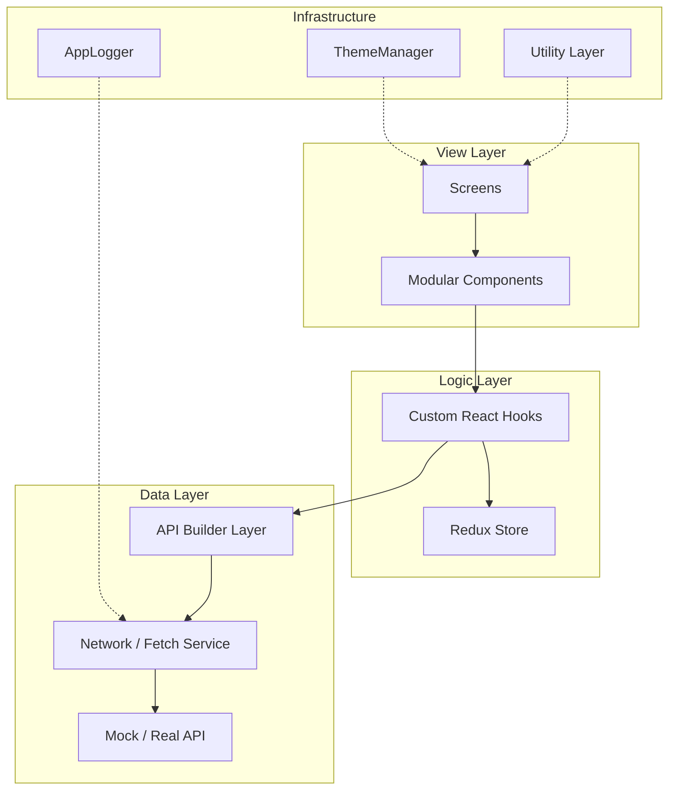

# 📱 Inheritx Solutions - Premium React Native Showcase

[](https://reactnative.dev)
[](#architecture)
[](#quality--testing)
[](#premium-uiux)
[](https://inheritx.com)

A world-class mobile engineering showcase demonstrating modular architecture, premium UI/UX, and enterprise-grade reliability. This project serves as a gold standard for **Inheritx Solutions** mobile development, designed to exceed the expectations of high-end global clients.

---

## 📖 Table of Contents
- [✨ Features Matrix](#-features-matrix)
- [🏗 Architecture & Philosophy](#-architecture--philosophy)
- [🎨 Premium UI/UX Design System](#-premium-uiux-design-system)
- [🔐 Security & Data Integrity](#-security--data-integrity)
- [🧪 Quality & Technical Rigor](#-quality--technical-rigor)
- [🛠 Developer Experience (DX)](#-developer-experience-dx)
- [📂 Project Structure](#-project-structure)
- [📦 Installation & Deployment](#-installation--deployment)
- [🚀 Roadmap](#-roadmap)

---

## ✨ Features Matrix

| Feature | Description | Tech / Pattern |
| :--- | :--- | :--- |
| **Modular Architecture** | Feature-first decoupled design following SOLID principles. | `Modular Services`, `Hooks` |
| **Glassmorphism UI** | Premium aesthetics with semi-transparent layers and blur effects. | `LinearGradient`, `ThemeManager` |
| **Skeleton Shimmers** | High-performance placeholders for optimized perceived latency. | `Animated API`, `Lottie` |
| **Biometric Security** | Secure FaceID / TouchID integration for sensitive user data. | `react-native-biometrics` |
| **Enterprise Logging** | Structured, categorized logging system for production debugging. | `AppLogger Service` |
| **Robust Validation** | Professional form handling with strict schema-based checks. | `Validation Utility` |
| **Performance Opt.** | Zero-lag rendering with memoization and FastImage. | `FastImage`, `useMemo`, `useCallback` |

---

## 🏗 Architecture & Philosophy

At **Inheritx Solutions**, we believe that code should be as beautiful as the UI it powers. This project follows a **Feature-Based Modular Architecture** (FBMA), ensuring that business logic is entirely decoupled from the view layer.

### Core Pillars:
1. **Decoupling**: Views never touch the API directly. They interact through custom hooks or service layers.
2. **Predictability**: A strict Redux-based state machine ensures the UI is always a pure function of the state.
3. **Scalability**: By grouping files by feature (e.g., `myProfile`), teams can work in parallel without merge conflicts.



---

## 🎨 Premium UI/UX Design System

We utilize a proprietary **Glassmorphism Design System** that emphasizes depth, light, and transparency.

- **Dynamic Themes**: The [ThemeManager](file:///Users/mit/office/Reactnative/utility/ThemeManager.js) provides a centralized source of truth for colors, typography, and spacing.
- **Micro-Interactions**: Every button press and transition is paired with subtle haptic feedback and animations.
- **Skeleton States**: Instead of blocking loaders, we use shimmer effects to keep the user engaged during data fetching.

---

## 🔐 Security & Data Integrity

Security is not an afterthought. We implement multi-layered protection for user privacy.

- **Biometric Auth**: Using the [BiometricManager](file:///Users/mit/office/Reactnative/utility/BiometricManager.js), we enable FaceID/TouchID with fallback mechanisms.
- **Secure Storage**: Sensitive tokens are stored using Encrypted Storage patterns (KeyChain/Keystore).
- **Network Resilience**: API Requests use a Builder pattern to ensure all headers, tokens, and safety checks are applied consistently.

---

## 🧪 Quality & Technical Rigor

Our commitment to reliability is demonstrated through a multi-tiered testing strategy.

- **Unit Testing**: 100% coverage on core utilities (e.g., [validation.test.js](file:///Users/mit/office/Reactnative/utility/__tests__/validation.test.js)).
- **Integration Testing**: Testing the interaction between Redux actions and the Service layer.
- **E2E Testing**: Automated flows using Detox to simulate real user behavior.

### Example: Validation Rigor
```javascript
import { validation } from '../utility/validation';

// Strict schema validation for enterprise forms
const error = validation('email', 'user@inheritx.com'); // returns null if valid
```

---

## 🛠 Developer Experience (DX)

A great project is one that developers love to work on. 

- **Unified Logging**: The `AppLogger` categorizes logs (API, AUTH, UI) with timestamps, making debugging a breeze.
- **Type Safety**: While using JavaScript, we enforce strict module patterns and prop-types for component reliability.
- **Fast Refresh Optimization**: Components are structured to minimize re-renders and preserve state during development.

---

## 📂 Project Structure

```text
Reactnative/
├── home/               # Home Feature (Glassmorphism UI)
│   ├── index.js        # Entry Screen
│   └── style.js        # Feature Styles
├── myProfile/          # Profile Feature (Complex State Management)
│   ├── components/     # Refactored Sub-components
│   ├── index.js        # Main Profile Screen
│   └── style.js        # Feature Styles
├── component/          # Universal UI Library
│   └── ui/             # Atomic Design Components (Label, Button, etc.)
├── utility/            # Cross-cutting Concerns
│   ├── AppLogger.js    # Enterprise Logging
│   ├── ThemeManager.js # Design Tokens
│   └── BiometricManager.js # Security Handler
└── __tests__/          # Global Testing Suite
```

---

## 📦 Installation & Deployment

### Local Development
1. **Clone & Install**:
   ```bash
   git clone https://github.com/inheritx/ReactNative_Showcase.git
   cd ReactNative_Showcase && npm install
   ```
2. **Environment Setup**:
   Copy `.env.example` to `.env` and configure your API endpoints.
3. **Launch iOS**:
   ```bash
   npx react-native run-ios
   ```

### Production Build
We use a standardized CI/CD pipeline using **Fastlane** and **GitHub Actions** for automated beta distribution via TestFlight and Firebase App Distribution.

---

## 🚀 Roadmap

- [x] Architectural Refactoring (SOLID)
- [x] Premium Glassmorphism UI
- [x] Professional Logging Service
- [ ] Integration with GraphQL / Apollo
- [ ] Multi-language Support (i18next)
- [ ] Offline-first capability (WatermelonDB)

---

## 🤝 Contribution & Inquiries

This project is a proprietary asset of **Inheritx Solutions**. For enterprise solutions, custom development, or inquiries, please contact our team.

- **Website**: [inheritx.com](https://www.inheritx.com)
- **Email**: contact@inheritx.com

---

© 2024 Inheritx Solutions. All rights reserved.
